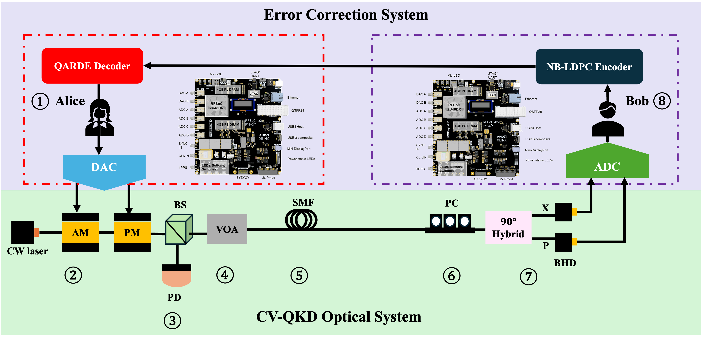
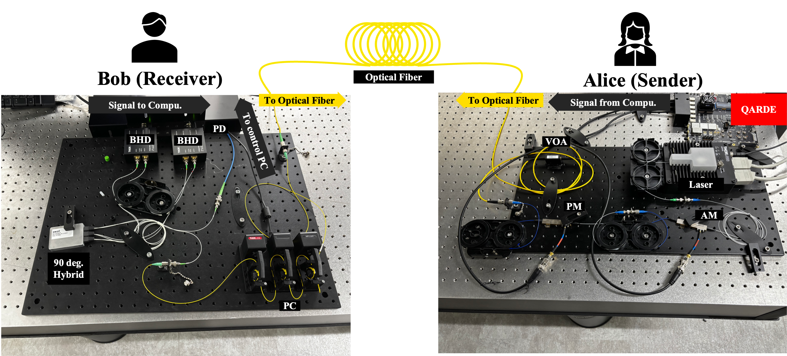
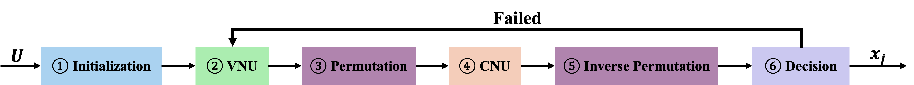
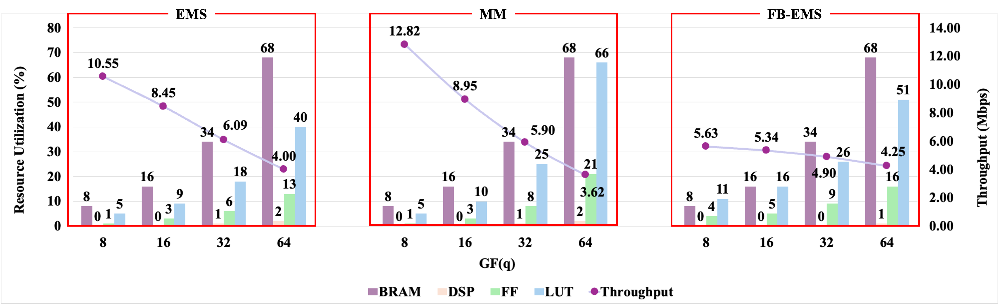
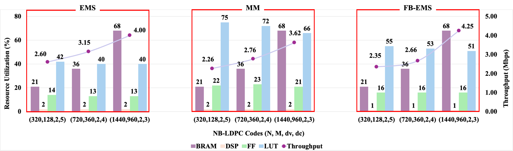
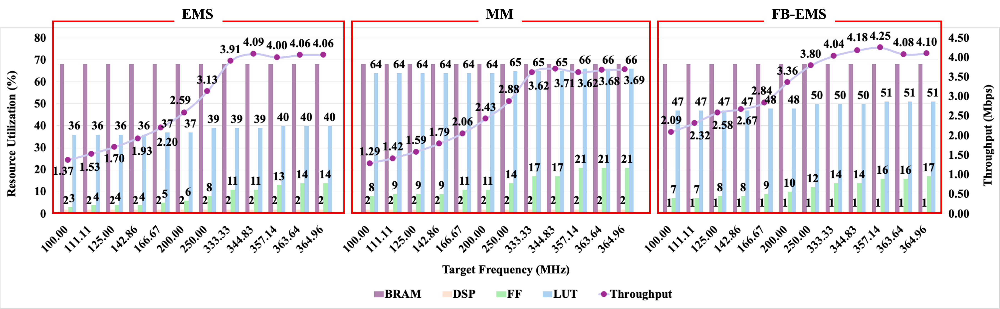

# QARDE
### Adaptive & Reconfigurable NB-LDPC Decoder Engine for CV-QKD on RFSoC FPGAs

<p align="center">
  
  
  
  
  
</p>

<p align="center">
  
</p>

<p align="center">
  <b>QARDE</b> is an adaptive and reconfigurable <b>non-binary LDPC (NB-LDPC) decoder engine</b>
  for <b>continuous-variable quantum key distribution (CV-QKD)</b>, targeting <b>RFSoC FPGA systems</b>.
  It unifies <b>EMS</b>, <b>MM</b>, and <b>FB-EMS</b> within a single HLS-based architecture.
</p>

---

## ✨ Highlights

- 🔁 **Multi-algorithm framework**  
  Unified support for **EMS**, **MM**, and **FB-EMS** in one architecture.

- ⚙️ **Runtime configurability**  
  Decoder mode, iteration limits, and control parameters can be selected at run time.

- 🚀 **FPGA-oriented performance**  
  Deeply pipelined message passing, multi-level parallelism, and structured on-chip memory organization.

- 📡 **CV-QKD deployment focus**  
  Designed for low-SNR reconciliation in practical CV-QKD systems on **RFSoC4x2**.

- 🧩 **Modular HLS implementation**  
  Clean decomposition into initialization, VNU, permutation, CNU, inverse permutation, and decision blocks.

- 📖 **Research-backed open-source framework**  
  Proposed and released as a research framework accompanying the QARDE paper.

---

## 📌 Overview

In CV-QKD systems, reconciliation is one of the dominant bottlenecks, especially in the low-SNR regime where
NB-LDPC decoding accounts for most of the computational cost. QARDE addresses this challenge with a scalable
FPGA architecture that combines:

- deeply pipelined message passing
- fine-grained parallelism
- carefully organized on-chip memory
- runtime algorithm configurability

QARDE is implemented in **C/C++ High-Level Synthesis (HLS)** and targets **RFSoC FPGA systems** for practical,
deployment-oriented CV-QKD reconciliation.

---

## 🏗️ System Context

QARDE is designed as part of an RFSoC-based CV-QKD reconciliation platform. The decoder sits in the digital
post-processing path and can interface naturally with mixed-signal RFSoC-based DAC/ADC infrastructure.

<p align="center">
  
</p>
<p align="center"><i>Deployment-oriented RFSoC-based CV-QKD system context for QARDE.</i></p>

---

## 🧠 Supported Decoder Modes

| Mode | Message Representation | Main Strength | Typical Advantage |
|---|---|---|---|
| **EMS** | Truncated q-ary candidate lists | Strong decoding performance with reduced complexity | Good balance between performance and cost |
| **MM** | Full-length q-ary messages | Regular and hardware-friendly datapath | High throughput and simpler control |
| **FB-EMS** | Truncated lists with forward-backward recursion | Reduced logic and memory usage | Efficient CNU realization with strong practical performance |

### EMS
EMS truncates each q-ary message to the top-`nm` candidates and performs reduced-complexity check-node processing.
It achieves near-BP performance with significantly lower complexity.

### MM
MM uses full-length q-ary messages and replaces sum-based convolution with min-max operations, resulting in a regular
and hardware-friendly implementation with strong throughput potential.

### FB-EMS
FB-EMS keeps truncated lists like EMS, but replaces direct multi-input EMS convolution with a forward-backward chain
of 2-input EMS operations. This reduces logic and memory usage while preserving strong decoding performance.

---

## 🔄 Unified Decoder Flow

QARDE follows a common NB-LDPC message-passing pipeline:

<p align="center">
  
</p>

```text
Initialization
   ↓
Variable Node Update (VNU)
   ↓
Permutation
   ↓
Check Node Update (CNU)
   ↓
Inverse Permutation
   ↓
Decision / Syndrome Check
```

This unified flow is shared across **EMS**, **MM**, and **FB-EMS**. The principal difference among modes lies in the
implementation of the **CNU** stage.

---

## 🧱 Main Architecture Modules

| Module | Role |
|---|---|
| `QARDE_init` | Builds the Tanner graph from COO-format `H`, constructs adjacency tables, edge metadata, and permutation tables, and clears message buffers |
| `QARDE_vnu` | Performs variable-node update, extrinsic combination, minimum-based normalization, optional correction, and clipping |
| `QARDE_perm` | Maps VN-domain messages into CN-domain messages using edge coefficient permutation tables |
| `QARDE_cnu` | Implements the selected check-node update mode: **EMS**, **MM**, or **FB-EMS** |
| `QARDE_invperm` | Converts C2V messages back from CN domain to VN domain |
| `QARDE_dec` | Computes a-posteriori metrics, forms hard decisions, and performs syndrome checking for early stopping |

---

## ⚙️ Design Philosophy

QARDE is designed to balance three competing objectives:

- **Error-correction performance**
- **Throughput**
- **Hardware cost**

Rather than locking the system to a single decoding algorithm, QARDE provides a **reconfigurable operating space**:

- **EMS** for strong decoding quality
- **MM** for regularity and throughput
- **FB-EMS** for reduced logic and memory usage

This makes QARDE suitable for different channel conditions, code parameters, and deployment constraints in CV-QKD systems.

---

## 📊 Reported Performance Snapshot

The QARDE paper reports RFSoC4x2 decoding throughput in the range of **2.26–12.82 Mbps** across evaluated code
sizes, field orders, and decoder modes.

To highlight evaluation trends, the following figures can be included directly in the repository documentation.

<p align="center">
  
  
  
</p>

---

## 🛠️ Implementation Notes

- **Design flow:** C/C++ High-Level Synthesis (HLS)
- **Target platform:** RFSoC FPGA systems
- **Application:** CV-QKD reconciliation
- **Supported modes:** EMS / MM / FB-EMS
- **Run-time configurable:** mode selection, iteration count, decoder controls
- **Compile-time specialized:** field order, graph dimensions, degree constraints, parallelism factors

---

## 📂 Repository Structure

```text
QARDE/
├── src/
│   ├── nb_ldpc.hpp
│   ├── qarde.hpp
│   ├── qarde_accel.cpp
│   ├── qarde_config.hpp
│   ├── qarde_dec.hpp
│   ├── qarde_ems_cnu.hpp
│   ├── qarde_fbems_cnu.hpp
│   ├── qarde_gf.hpp
│   ├── qarde_init.hpp
│   ├── qarde_mm_cnu.hpp
│   ├── qarde_perm.hpp
│   ├── qarde_tools.hpp
│   └── qarde_vnu.hpp
├── .gitignore
└── README.md
```

---

## 📚 Paper

**QARDE: A CV-QKD-based Adaptive Reconfigurable NB-LDPC Decoder Engine for RFSoC FPGA Systems**  
Kaijie Wei, Devanshu Garg, Ryutaro Nagai, Takao Tomono, and Hideharu Amano.

---

## 🔗 Project Link

The paper references the open-source project repository at:

`https://github.com/WKJSpace/QARDE.git`

---

## 🙌 Citation

```bibtex
@article{wei2026qarde,
  author = {Wei, Kaijie and Garg, Devanshu and Nagai, Ryutaro and Tomono, Takao and Amano, Hideharu},
  title  = {QARDE: A CV-QKD-based Adaptive Reconfigurable NB-LDPC Decoder Engine for RFSoC FPGA Systems},
  journal = {ACM Transactions on Reconfigurable Technology and Systems},
  year   = {2026},
  note   = {Manuscript submitted to ACM}
}
```
